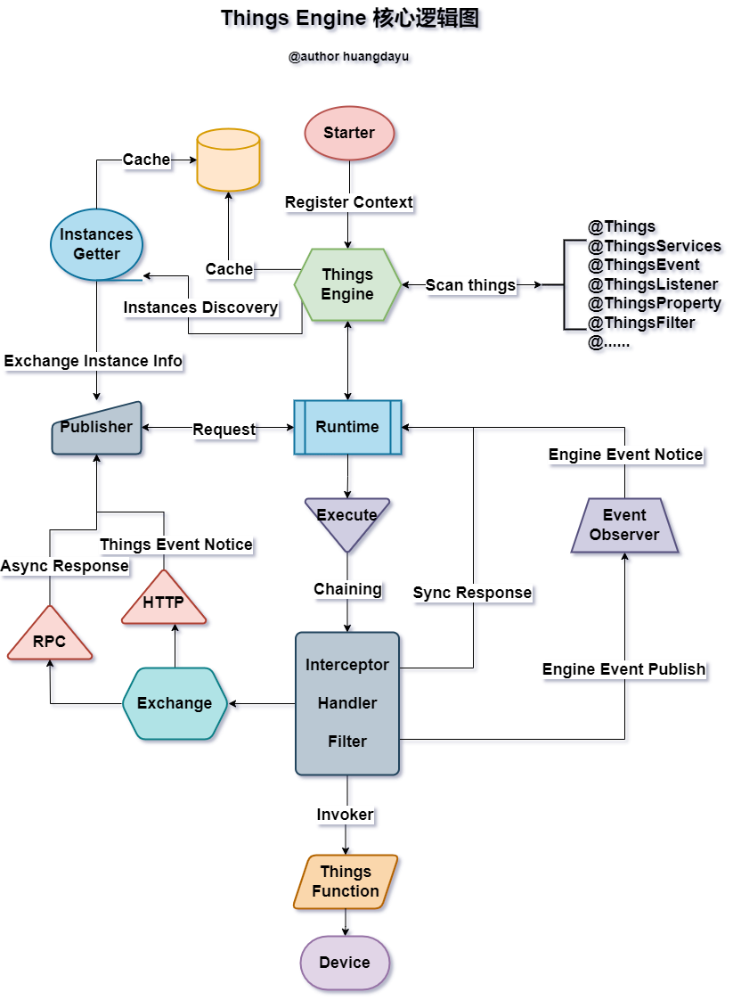
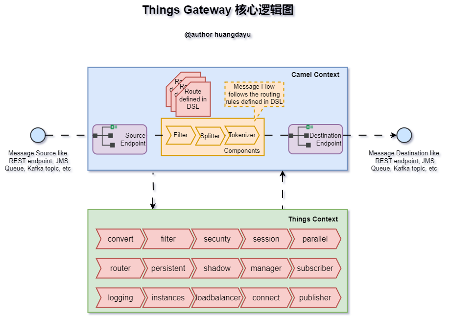

<blockquote class="blockquote-center">
<p style="font-size: 30px;text-align: center;">物联网旨在增强人们掌控万物的能力。</p>  
</blockquote>

## 物联网物模型框架

物联网物模型框架（things-framework），基于物模型DSL设计思想，抽象物联网设备服务，事件和属性，以物模型消息驱动的物联网框架。旨在解决以下物联网开发的痛点：

- 降低物联网平台与设备的开发，对接，集成，适配的难度，降低物联网平台复杂度；
- 降低物联网应用开发成本，以统一的物模型DSL规范对接使用，提高应用开发效率；

物模型特定设计语言（DSL）是设备抽象的唯一标准，物模型消息是通讯协议统一规范，一切以物模型为驱动力。

### 版权声明

> 版权私有，未经授权，不得商用。

### 软件工程架构

- things-engine: 物模型消息驱动引擎，实现物模型DSL管理、消息生成、发布、订阅、解析、拦截、处理、过滤、缓存等功能，实现物模型服务调用、属性读写、事件上报、事件订阅等功能；
- things-gateway: 物模型消息网关，实现会话管理、实例管理、安全验证、消息转换、消息路由、消息拦截、消息过滤、消息缓存、消息持久化、消息订阅发布、组件管理、订阅管理、物影子管理、日志存储、事件溯源、设备连接适配、规则引擎、设备联动、场景控制等功能；
- things-generate： 物模型代码生成器，基于物模型DSL，生成物模型模板代码，提高开发效率；
- things-starter： 物模型框架启动器，基于SpringBoot实现物模型框架的快速集成，基于SpringCloud实现物模型引擎实例的服务注册，发现，管理等功能；
- things-example: 物模型框架示例，基于物模型框架，实现物模型服务调用、属性读写、事件上报、事件订阅等功能的示例；

### 物模型框架架构拓扑图


- IOT Device：象征物联网设备；
- Application/Platform： 业务应用平台或者客户端APP等使用物模型的客户端；
- IOT Platform：IOT平台或具备物联网能力的第三方平台；
- Things Engine Edge Instance： 物模型引擎边缘服务实例；
- Edge Connect Components： 物模型引擎边缘服务连接组件，也可是MQTT等服务；
- Nginx / LVS / Cloud Gateway： 网关层，负载均衡层；
- Things Engine Adapter Instance：物模型引擎平台或者设备适配实例；
- MQTT / TCP Components：设备连接管理组件；
- Things Engine Gateway Instances：物模型引擎网关实例；
- Things Engine Usecase Instances： 物模型引擎业务用例实例；
- Framework / Components：代表应用开发框架；
- Infrastructure： 代表数据库、缓存、中间件等基础设施服务；


架构设计上，遵循SOLID原则进行设计，职责上，负责设备的连接、物模型适配、物模型消息网关、物模型业务应用、框架接口隔离、基础设施反腐隔离。


### 物模型引擎核心逻辑图




物模型引擎基于注解、反射、动态代理、事件驱动、依赖注入实现的物模型消息驱动的执行引擎框架，核心逻辑上是对所有物模型注解的类和方法进行扫描并缓存对象好函数、可根据物模型引擎扫描的信息生成物模型JSON结构，以服务调用为例，当接收到物模型消息之后，进行消息的解析，进行链式处理（拦截、处理、过滤），调用服务时、将查找对应的Bean和Function，并进行参数转换填充，然后函数调用并返回结果，如果是异步便将结果请求到客户端的物模型端点。发布物模型事件时，也会基于物模型事件对象的注解转换成物模型消息结构，并向上游服务发布。


### 物模型网关核心逻辑图




物模型网关的核心逻辑是基于Apache Camel实现的多组件的消息接收、拦截、路由、处理和分发，只要Apache Camel支持的组件都将可以接入物模型网关，都可以输入物模型消息和接收物模型消息及事件。物模型的消息处理包括消息转换，过滤，安全验证，会话管理，路由分发，持久化，物影子保存，物模型实例管理，物模型消息订阅发布，日志追踪，事件溯源，负载均衡，通用设备连接（如WebSocket），规则引擎，设备场景联动等能力。


### 快速集成

#### 集成条件

- JDK 21+
- SpringBoot 3.1.0+

#### 引入依赖

```groovy
implementation 'cn.huangdayu.things:things-spring-boot-starter:2024.1.0'
```
