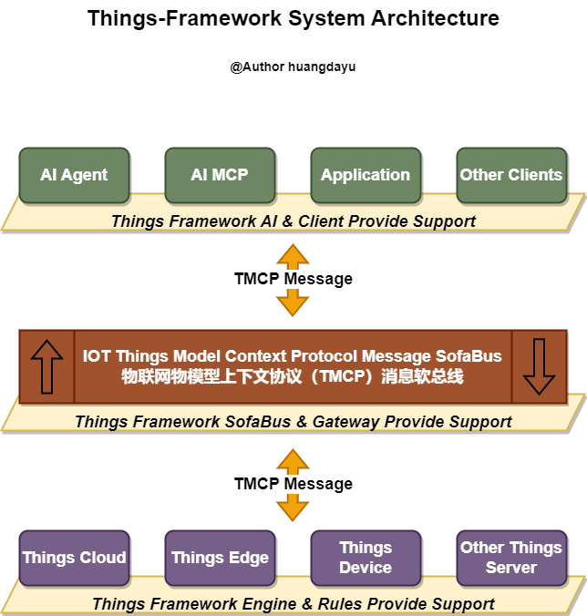

<blockquote class="blockquote-center">
<p style="font-size: 24px;text-align: center;">物联网旨在万物互联协同为人们提供更好的服务。</p>
<p style="font-size: 24px;text-align: center;">物联网物模型上下文协议（TMCP）旨在让万物用同一种语言互联协同。</p> 
<p style="font-size: 24px;text-align: center;">Things Framework 旨在为物模型上下文协议（TMCP）的落地提供完整解决方案。</p>
</blockquote>

## 为什么需要 Things-Framework

物联网发展这些年已然与人们最初设想的万物互联的世界已经渐行渐远，暴露出来的种种问题让人们对未来物联网的发展表露出担忧。就在这关键时刻，大模型的发展与进化给物联网生态带来了新的影响和启发，大模型将成为物联网的下一个入口。 如何将大模型融入物联网生态中，扩大物联网的能力和边界，使物联网能够更好的为人们服务，这是接下来物联网生态发展的头等大事。大模型的Agent和MCP的诞生与演进，为大模型带来了身体和使用各种各样工具的能力，其中MCP协议给了我重要的启发。 物联网不经要解决设备与设备之间夸生态夸网络夸应用之间的互联协同问题，也要解决如何在大模型的驱动下更好的为用户提供数据分析，设备控制，设备互联，事件处理等服务，所以，我参考了大模型的MCP协议，提出了物联网物模型上下文协议（TMCP）的物联网设备与设备，设备与大模型之间的通讯协议。 物联网物模型上下文协议（TMCP）是基于大模型MCP服务和JsonRPC协议和物联网物模型标准的互联互通解决方案，他能够解决大模型与物模型之间的鸿沟，使物联网的万物互联得到新的补充，而Things-Framework则是为了物模型上下文协议（TMCP）的落地提供完整解决方案。

## 什么是 Things-Framework

Things-Framework基于物模型DSL设计思想和物模型上下文协议，抽象物联网设备服务，事件和属性，以TMCP消息驱动的物联网消息驱动架构的开发框，旨在解决以下物联网开发的痛点：

- 降低物联网物模型的设备，平台，应用接入大模型的开发难度和服务稳定性等问题；
- 降低物联网平台与设备的开发，对接，集成，适配的难度，降低物联网平台复杂度；
- 降低物联网应用及设备的开发成本，以统一物模型上下文协议开发，提高开发效率；



模块说明：

- things-ai： 大模型对接模块，实现物模型上下文协议（TMCP）对大模型的Agent和MCP进行适配支持。
- things-api： API抽象模块，抽象各种API接口，使整个框架模块间的耦合度更低。
- things-client： 客户端对接模块，为各种客户端的接入提供便捷的API能力，降低接入的复杂度和提高接入的效率。
- things-common： 公共模块，提供各种复用性比较高的模型对象和工具类等。
- things-dependencies： 依赖管理模块，为框架提供统一的依赖版本管理服务，避免依赖冲突等问题。
- things-engine： 消息执行引擎模块，实现物模型DSL管理、消息生成、发布、订阅、解析、拦截、处理、过滤、缓存等功能，实现物模型服务调用、属性读写、事件上报、事件订阅等功能。
- things-gateway： 消息网关模块，实现会话管理、实例管理、安全验证、消息转换、消息路由、消息拦截、消息过滤、消息缓存、消息持久化、消息订阅发布、组件管理、订阅管理、物影子管理、日志存储、事件溯源、设备连接适配、设备联动、场景控制等功能；
- things-rules： 规则引擎模块，实现基于TMCP消息的物模型规则引擎服务，适用于设备联动和场景执行等场景。
- things-sofabus： 消息软总线服务，支撑物联网物模型上下文协议（TMCP）的消息驱动架构的消息软总线服务。
- things-support： 框架支持模块，封装对SpringBoot，SpringCloud，Quarkus，SofaArk，Apache Camel等框架的支持工作。

## 如何使用 Things-Framework


集成条件： 

- JDK 21+
- SpringBoot 3.1.0+

引入依赖：

```groovy
implementation 'cn.huangdayu.things:things-spring-boot-starter:2024.1.0'
```

## 版权声明

> 版权私有，未经授权，不得商用。
