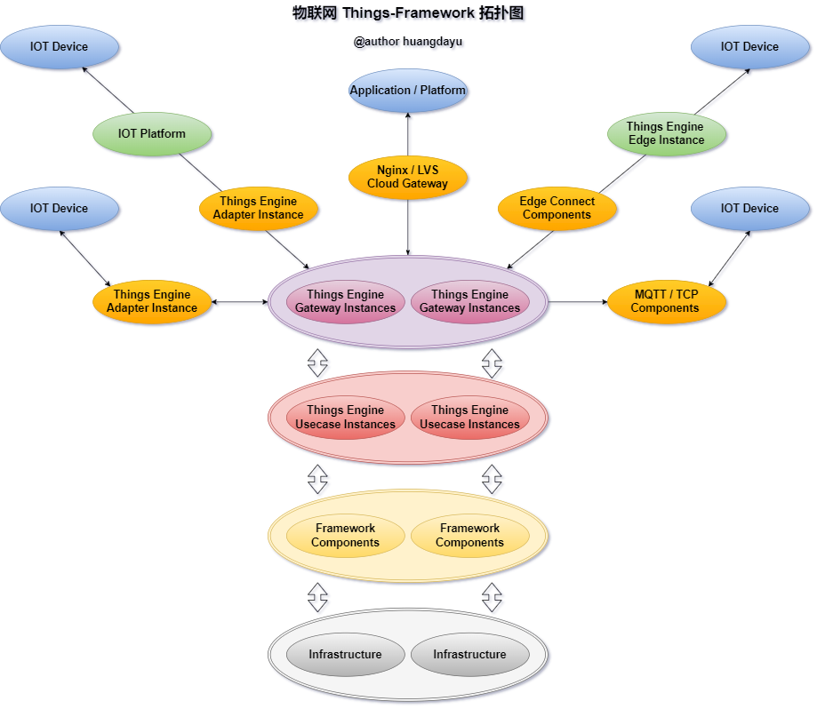

<br>
<p style="font-size: 24px;text-align: center;">物联网旨在增强人们掌控万物的能力。</p>
<br>

## 物联网物模型框架

物联网物模型框架（things-framework），基于物模型DSL设计思想，抽象物联网设备服务，事件和属性，以物模型消息驱动的物联网框架。旨在解决以下物联网开发的痛点：

- 降低物联网平台与设备的开发，对接，集成，适配的难度，降低物联网平台复杂度；
- 降低物联网应用开发成本，以统一的物模型DSL规范对接使用，提高应用开发效率；

### 软件工程架构

- things-engine: 物模型消息驱动引擎，实现物模型DSL管理、消息生成、发布、订阅、解析、拦截、处理、过滤、缓存等功能，实现物模型服务调用、属性读写、事件上报、事件订阅等功能；
- things-gateway: 物模型消息网关，实现会话管理、实例管理、安全验证、消息转换、消息路由、消息拦截、消息过滤、消息缓存、消息持久化、消息订阅发布、组件管理、订阅管理、物影子管理、日志存储、事件溯源、设备连接适配等功能；
- things-generate： 物模型代码生成器，基于物模型DSL，生成物模型模板代码，提高开发效率；
- things-starter： 物模型框架启动器，基于SpringBoot实现物模型框架的快速集成，基于SpringCloud实现物模型引擎实例的服务注册，发现，管理等功能；
- things-example: 物模型框架示例，基于物模型框架，实现物模型服务调用、属性读写、事件上报、事件订阅等功能的示例；

### 架构拓扑图



### 快速集成

#### 集成条件

- JDK 21+
- SpringBoot 3.1.0+

#### 引入依赖

```groovy
implementation 'cn.huangdayu.things:things-spring-boot-starter:2024.1.0'
```
